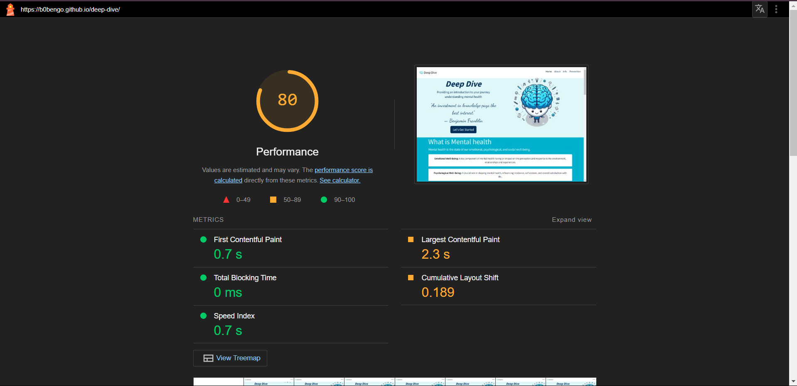

# Deep Dive: Mental Health Awareness Website

Welcome to Deep Dive - an independent website challenge from Code Institute
## Project Summary
### Overview

This project is to be a single-page, responsive website using HTML, CSS and Bootstrap infomring users about mental at a beginner level.

## List of Features

Planned features of the website include:
- A navbar for easy navigation through sections of the website and a collapsed version of the navbar (hamburger) for smaller devices

- Different size headings to signify the start of new sections accompanied by a background change or or regular informative text

- Dropdown menu cards that reveal more information upon activation to avoid repetition of styles

- Images along with cards for a quick way to describe a topic being discussed

- A footer containing social media info that users can click to go to

- ARIA-labels where applicable to enhance accessability

## Project Design (UX/UI)
### Aims

Upon completetion this website should be able to:

- Allow users to navigate through the page with ease towards desired sections containing relevant information and access additional resources.
- Offer clear, straightforward information on mental health topics, focusing particularly on how to recognise common issues and manage stress.

### User Stories

- As a user, I want to easily navigate the website so I can find information on mental health topics quickly.
- As a user, I want to understand basic mental health concepts so I can improve my knowledge.
- As a user, I want to access resources and links to external sites so I can get more detailed information.
- As a user, I want to find tips on managing stress so I can apply them in my daily life.
- As a user, I want to learn how to recognize signs of mental health issues so I can support my loved ones.
- As a user, I want the website to be responsive so I can access it on my phone or tablet.
- As a user, I want the website to be accessible so I can navigate and read the content easily.

### Wireframes
A wireframe was designed to picture what the intended website should appear as while also including some functionality in the dropdown menu for example. Balsamiq wsa chosen because it is quick and low-fidelity meaning it is sufficient enough for functionality without comprimising design.

#### Mobile wireframe:

#### Tablet wireframe:

#### Desktop wireframe:

### Colour
#### Colour thought process

A descending colour palette was chosen to as a reflection of the latter part of the website's name - "Dive". This was considered to create the imagery of the user diving into mental health information and the deeper they go in the website the more the learn.

Moreover, the choice of descending blue represented ocean colours with an attempt to emphasize how deep mental health can be.

Here is a link to the website where the color palette was picked from: <a href="https://piktochart.com/tips/ocean-color-palette" target="_blank" rel="noopener noreferrer" aria-label="Link to color pallette">Ocean colour palette</a>

#### Contrast checker

Although the idea of having the ocean colour palette was a decent idea, it ended up causing some problems. The main problem was because the design involved changing backgrounds as the user progressed, the need to change the font colour along the way seemed imperative yet also wrong. As a result, some plans failed the contrast checker test.

### Font

During the design of the website, a decision was made to have a max of three fonts to not overwhelm the user with different styling. Ultimately, two were selected: one for the body of the site (Source Sans Pro) while the other for inspirational quotes (Dancing Script).

## Composition

Deep Dive was able to be completed through the HTML, CSS and Git languages, with the help of Bootstrap to aid with responsive design and finally deployed using GitHub.

## Validation and Performance (Testing)

Here are some evidence of validation used to check the code doesn't contain errors in both html and css:

### HTML Validation

### CSS Validation

Here is the review of the performance of the website:

### Light House Performance

Not a bad mark, a little off the 90 mark, however this may be due to lack of content.

#### Performance Improvements

Google Lighthouse suggests:
- Using different image formats specifically "next-gen" ones like WebP as opposed to png to save data and increase download speed
- Properly sizing images to save space
- Avoiding significant layout shifts. This was due to paragraphs being too long in drop down menus and or cards causing stretching when interacted with.

## Deployment

This [GitHub](https://github.com/) project was created using the [Code Institute Template](https://github.com/Code-Institute-Org/ci-full-template) ensuring all necessary dependencies were included when opening within the designated workspace on the [Gitopod IDE](https://www.gitpod.io/).

Setup a repo using this method and template:
1. Login to your GitHub profile.
2. Navigate to the Code Institute Full Template
3. Click the dropdown for 'Use this template' and select "Create a new repository"
4. Generate the necessary name and description for your repo and click 'Create repository from template'
5. Navigate to the new repo and click the green 'Open' button with the Gitpod logo 
**IMPORTANT - This button should only be clicked once to generate the new IDE workspace**
6. You can now work on your repository within the Code Institute Gitpod IDE workspace

Once the project repo is created, an early deployment for the live project should performed. 
This allows for early and continuous testing using a variety of devices, as well as the Dev Tools available within browsers.

Additional information on the deployment process can be found on the official [GitHub Docs](https://docs.github.com/en/pages/quickstart)

## Citations

- Chat GPT: This AI tool was used to generate text to be refined and placed a scontent in the body of the website
- Co Pilot: This AI tool was used to suggest improvements to the code and generate images using promts.
- Microsoft designer: This AI tool was used to adjust the images from Co Pilot to a desired outcome.

## Improvements (Future Features)

There were quite a few improvements to be made revolving around the layout of as the size of device increased. While the mobile viewpoint was more concise and easy to follow through, the larger counterparts ended having a lot of unnecessary space making the display appear empty or boring.

A massive mistake was not using the colour contrast tool sooner because it neglets the thought that some peopl may not be able to read the text provided making not user-friendly. This had a knock on effect during the implementation of code while being unnoticed. Features such as links and icons became hard to show if the cursor was on them or they were about to be pressed. A way to combat this error in this scenario could be to focus on animating the links when they are being hovered over. For example, the social links at the bottom could have been animated to rise slightly so that relative to the other icons the user knows that they are hovering on their desired icon. Due to this the nav tiems in the navbar were not able to be styled correctly so the user can notice the hover change of colour.

Another point to mention is the use of bootsrtap. Althoug bootstrap is an amazing tool over use may lead to websites becoming repatitve and not unique. An issue that was identified was the styling of the navbar. Perhaps there could have been a better way to style it differently rather than the default one.

